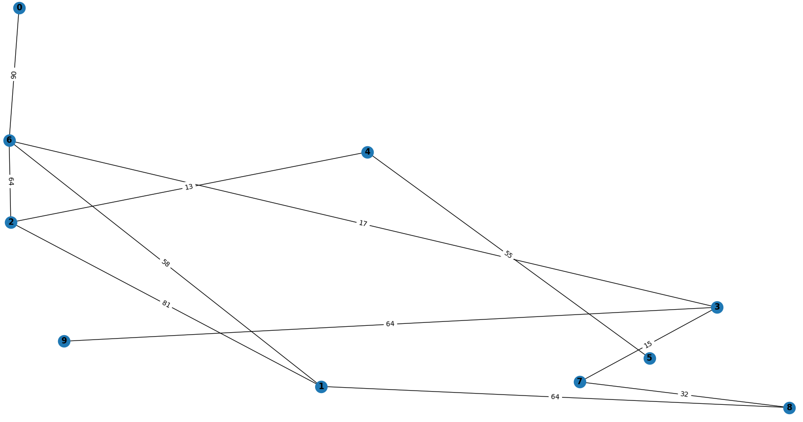

# Завдання 1

## Побудова графу та аналіз його основних характеристик

Кількість вершин 10

Кількість ребер 13

Граф сполучений (зв’язний) True

Вершина 6 має найбільший ступінь 4

Середній найкоротший шлях 2.088888888888889

Вершина 2 має найбільший ступінь центральності 0.4444444444444444

Вершина 2 має найбільший ступінь близькості 0.6428571428571429

Вершина 2 має найбільший ступінь посередництва 0.3333333333333333

# Завдання 2

## Порівняння алгоритмів DFS і BFS для знаходження шляхів у графі

### Шляхи обходу графу для кожного алгоритма

DFS

0 8 7 2 1 5 4 3 9 6 

BFS

0 8 2 3 7 1 5 4 6 9 

### Висновки

Як бачимо, алгоритм DFS робить обхід графу у глибину, тобто він отримує список сусідів для початкової вершини. Пошук у глибину (DFS) виконується шляхом відвідування вершини, а потім рекурсивного відвідування всіх сусідніх вершин, які ще не були відвідані. Це продовжується доки у поточної вершини не буде сусідів, або всі сусіди були вже відвідані. Далі повертається на один рівень і відвідує наступного сусіда, якщо ще є невідвідані.

Для алгоритму пошуку у ширину BFS послідовність інша. Спочатку він відвідує всі вершини на певному рівні перед тим, як перейти до наступного рівня, а дали ітеративно "відвідуються" сусіди сусідів. Так продовжується доки у поточної вершини не буде сусідів, або всі сусіди були вже відвідані. На цьому алгоритм завершується.

Для обох алгоритмів справедливим є те, що послідовність вибирання сусіда не є сталою, оскільки при отриманні сусідів для поточної вершини ми отримуємо словник, звідки формуемо список сусідів, а при такій операції словник не гарантує ту саму послідовність сусідів у списку. Тому при багатократному запуску алгоритмів послідовність відвіданих вершин може змінуватись на рівні сусідів, але не на рівні кроків пошуку, описаних вище.

# Завдання 3

## Алгоритм Дейкстри для знаходження найкоротшого шляху

Відстань від 0 до 0: 0

Відстань від 0 до 1: 138

Відстань від 0 до 2: 58

Відстань від 0 до 3: 100

Відстань від 0 до 4: 112

Відстань від 0 до 5: 90

Відстань від 0 до 6: 219

Відстань від 0 до 7: 144

Відстань від 0 до 8: 73

Відстань від 0 до 9: 214
